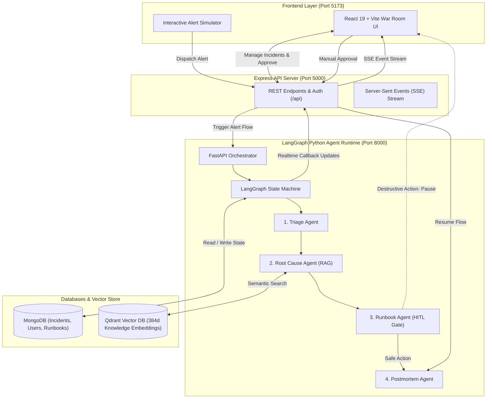

# ⚡ IncidentIQ — AI-Powered Autonomous SRE On-Call Investigator

> **Turn *"alert fired, now dig for an hour"* into *"here is the likely root cause, backed by evidence and past postmortems, ready for your approval in 30 seconds."***

[](https://github.com/prathamTamrakar/IncidentIQ)
[](https://qdrant.tech/)
[](https://www.mongodb.com/)
[](https://opensource.org/licenses/MIT)

---

## 📑 Table of Contents

- [Overview & Problem Statement](#-overview--the-problem)
- [Key Features](#-key-features)
- [System Architecture](#-system-architecture)
- [Multi-Agent LangGraph Workflow](#-multi-agent-langgraph-workflow)
- [Retrieval-Augmented Generation (RAG)](#-retrieval-augmented-generation-rag)
- [Tech Stack](#-tech-stack)
- [Project Directory Structure](#-project-directory-structure)
- [Getting Started & Local Setup](#-getting-started--local-setup)
  - [Prerequisites](#prerequisites)
  - [1. Infrastructure (MongoDB & Qdrant)](#1-infrastructure-mongodb--qdrant)
  - [2. Environment Configuration](#2-environment-configuration)
  - [3. Database Seeding](#3-database-seeding)
  - [4. Starting the Services](#4-starting-the-services)
- [Interactive Alert Simulator Scenarios](#-interactive-alert-simulator-scenarios)
- [API Reference](#-api-reference)
- [Design Principles & Safety Guardrails](#-design-principles--safety-guardrails)
- [Roadmap](#-roadmap)
- [License](#-license)

---

## 🚨 Overview & The Problem

When production breaks at 3:00 AM, Site Reliability Engineers (SREs) and on-call responders face:
1. **Alert Storms:** Hundreds of noisy alerts across microservices obscuring the origin failure.
2. **Scattered Context:** Jumping between Grafana dashboards, Loki logs, GitHub deploy histories, and outdated wikis.
3. **High MTTR (Mean Time to Resolution):** 30–90 minutes wasted correlating symptoms rather than applying fixes.
4. **Fear of Destructive Automation:** Autonomous scripts blindly running remediation without human safety gates.

### The Solution
**IncidentIQ** is an autonomous on-call investigation platform that ingests alerts, analyzes raw telemetry, retrieves past postmortems via semantic vector search (RAG), matches executable runbooks, and proposes evidence-backed hypotheses. For risky actions, it halts safely and awaits human approval.

---

## ✨ Key Features

- 🤖 **4-Stage LangGraph Multi-Agent Pipeline:** Autonomous Triage, Root Cause Analysis, Runbook Recommendation, and Postmortem Synthesis.
- 🔍 **RAG via Qdrant Vector Search:** Semantic retrieval of historical incidents, error signatures, and runbook procedures with service metadata filtering.
- 🛑 **Human-in-the-Loop (HITL) Safety Gates:** Destructive runbooks (e.g., database replica restarts, node scaling) require explicit engineer approval. Non-destructive actions are executed safely.
- 📡 **Real-time War Room UI:** Live updates via Server-Sent Events (SSE) showing real-time agent reasoning steps, diagnostic logs, and timeline progress.
- 🧪 **Interactive Alert Simulator:** Test pre-configured production failure scenarios (Kubernetes OutOfMemory crash, Redis connection pool exhaustion, Auth Gateway JWKS token failure).
- 📝 **Automated Postmortem Generator:** Produces executive summaries, error signatures, chronological timelines, and action items formatted in Markdown.

---

## 🏛️ System Architecture



---

## 🤖 Multi-Agent LangGraph Workflow

```
[Raw Alert Logs Ingested]
         │
         ▼
┌─────────────────────────┐
│     1. Triage Agent     │ ──► Parses raw logs, classifies error type, affected
└─────────────────────────┘     service, and assigns P1 / P2 / P3 severity level.
         │
         ▼
┌─────────────────────────┐
│   2. Root Cause Agent   │ ──► Performs RAG over Qdrant to find matching historic
└─────────────────────────┘     incidents; outputs ranked hypothesis with citations.
         │
         ▼
┌─────────────────────────┐
│    3. Runbook Agent     │ ──► Matches remediation runbook from database.
└─────────────────────────┘
         │
         ├───► Non-destructive: Auto-executes & marks resolved ──┐
         │                                                      │
         └───► Destructive: HALTS and prompts human responder   │
                     │                                          │
                     ▼ (Human Approves in War Room UI)          │
         ┌─────────────────────────┐                            │
         │   4. Postmortem Agent   │ ◄──────────────────────────┘
         └─────────────────────────┘
                     │
                     ▼
       Generates structured Markdown Postmortem
       (Executive summary, timeline, root cause, action items)
```

---

## 🔍 Retrieval-Augmented Generation (RAG)

The RAG subsystem is defined in [`agents/app/rag.py`](agents/app/rag.py):

* **Vector Database:** [Qdrant](https://qdrant.tech/) storing 384-dimensional vector embeddings in the `knowledge_chunks` collection.
* **Metadata Mirroring:** MongoDB `knowledge_chunks` maintains dual indexing for relational query filters.
* **Target Data:** Historical postmortems, past root-cause resolutions, and standard operating procedures (SOPs).
* **Service Scoped Search:** Exact-match payload filtering by affected microservice (`checkout-service`, `payment-service`, `auth-gateway`) with automatic global fallback.
* **Citations & Grounding:** The RCA agent quotes specific past incident IDs and historical context rather than hallucinating answers.

---

## 🛠️ Tech Stack

| Layer | Technologies |
| :--- | :--- |
| **Frontend** | React 19, TypeScript, Vite, Tailwind CSS, Lucide Icons, React Markdown |
| **Backend API** | Node.js, Express.js, Mongoose, JSON Web Tokens (JWT), Axios, SSE |
| **Agent Core** | Python 3.10+, FastAPI, Uvicorn, LangGraph, Pydantic |
| **AI / LLM Integration** | Google Gemini (`gemini-1.5-pro` / `gemini-1.5-flash`), OpenAI (`gpt-4o`), MockLLM fallback |
| **Databases & Vector Store** | MongoDB (State & Data), Qdrant (Vector Embeddings) |
| **DevOps / Containers** | Docker, Docker Compose |

---

## 📁 Project Directory Structure

```text
IncidentIQ/
├── agents/                      # Python LangGraph Agent Subsystem
│   ├── app/
│   │   ├── config.py            # DB, Qdrant, and LLM configuration
│   │   ├── graph.py             # LangGraph state machine definition
│   │   ├── main.py              # FastAPI server entrypoint (:8000)
│   │   ├── nodes.py             # Triage, RCA, Runbook, Postmortem nodes
│   │   ├── rag.py               # Qdrant vector indexing and RAG retrieval
│   │   └── seed.py              # Seeding script for users, runbooks & RAG data
│   ├── .env.example             # Agent environment template
│   └── requirements.txt         # Python dependencies
├── backend/                     # Node.js Express API Subsystem
│   ├── src/
│   │   ├── models/              # Mongoose schemas (Incident, Runbook, User)
│   │   ├── routes/              # Auth, Incident, Alert, Runbook, SSE routes
│   │   └── app.js               # Express server entrypoint (:5000)
│   ├── .env.example             # Backend environment template
│   └── package.json
├── frontend/                    # React + Vite Frontend Dashboard
│   ├── src/
│   │   ├── components/          # Dashboard, IncidentDetail, AlertSimulator, etc.
│   │   ├── App.tsx              # Main application router and state
│   │   └── index.css            # Tailwind & custom CSS
│   ├── package.json
│   └── vite.config.ts
├── docker-compose.yml           # Local MongoDB & Qdrant container services
└── README.md
```

---

## 🚦 Getting Started & Local Setup

### Prerequisites
- **Node.js** (v18.0 or higher)
- **Python** (v3.10 or higher)
- **Docker & Docker Compose** (for running MongoDB and Qdrant)

---

### 1. Infrastructure (MongoDB & Qdrant)

Start MongoDB and Qdrant in the background via Docker:

```bash
docker-compose up -d
```
* MongoDB will be available at `localhost:27017`
* Qdrant will be available at `localhost:6333`

---

### 2. Environment Configuration

#### Backend Configuration (`backend/.env`)
Create `backend/.env` (or copy from `backend/.env.example`):
```ini
PORT=5000
MONGODB_URI=mongodb://127.0.0.1:27017/incidentiq
JWT_SECRET=supersecret_incidentiq_jwt_key_2026
AGENT_SERVICE_URL=http://127.0.0.1:8000
```

#### Agents Configuration (`agents/.env`)
Create `agents/.env` (or copy from `agents/.env.example`):
```ini
MONGODB_URI=mongodb://127.0.0.1:27017/incidentiq
EXPRESS_API_URL=http://127.0.0.1:5000
GEMINI_API_KEY=your_gemini_api_key_here
# Optional: OPENAI_API_KEY=your_openai_api_key_here
```
*(Note: If no API key is provided, the agent runtime seamlessly falls back to the deterministic built-in `MockLLM` for offline testing).*

---

### 3. Database Seeding

Seed default runbooks, historical postmortems, and the default user account into MongoDB and Qdrant:

```bash
cd agents
# Activate your virtual environment first
python -m app.seed
```

Default credentials created:
- **Username:** `responder`
- **Password:** `password`

---

### 4. Starting the Services

Open 3 terminal windows to start all components:

#### Terminal 1: Backend Express Server (`:5000`)
```bash
cd backend
npm install
npm start
```

#### Terminal 2: LangGraph Agent Runtime (`:8000`)
```bash
cd agents
python -m venv venv

# Windows:
.\venv\Scripts\activate
# Linux/macOS:
# source venv/bin/activate

pip install -r requirements.txt
python -m app.main
```

#### Terminal 3: React War Room UI (`:5173`)
```bash
cd frontend
npm install
npm run dev
```

Open [http://localhost:5173](http://localhost:5173) in your browser.

---

## 🧪 Interactive Alert Simulator Scenarios

The frontend includes a built-in **Alert Simulator** (`frontend/src/components/AlertSimulator.tsx`) with three real-world outage scenarios:

1. **Scenario 1: Checkout Service OutOfMemory Error (`P1`)**
   - **Trigger:** Heavy traffic spike causing Node.js heap exhaustion and Kubernetes `CrashLoopBackOff` (Exit Code 137).
   - **RAG Match:** PM #102 memory leak history.
   - **Runbook:** *Scale Kubernetes Deployment* (Destructive $\rightarrow$ requires human approval).

2. **Scenario 2: Payment Service Redis Connection Refused (`P2`)**
   - **Trigger:** Redis socket exhaustion (`ECONNREFUSED 10.0.4.15:6379`).
   - **RAG Match:** PM #88 Redis socket pool saturation.
   - **Runbook:** *Flush Redis Cache* (Non-destructive $\rightarrow$ auto-approved and resolved).

3. **Scenario 3: Auth Gateway JWKS Signature Mismatch (`P2`)**
   - **Trigger:** Public key rotation failure causing global token verification rejection (`TokenVerificationError`).
   - **RAG Match:** PM #94 key expiration postmortem.
   - **Runbook:** *Rotate Auth Gateway Signature Keys* (Non-destructive $\rightarrow$ auto-executed).

---

## 🔌 API Reference

### Express Backend (`http://localhost:5000`)
- `POST /api/auth/login` — Responder authentication
- `GET /api/incidents` — List all tracked incidents
- `GET /api/incidents/:id` — Get detailed incident timeline, logs, and state
- `POST /api/incidents` — Ingest raw alert / trigger investigation pipeline
- `PUT /api/incidents/:id/agent-update` — Internal callback endpoint for agent progress updates
- `POST /api/incidents/:id/approve` — Human approval/rejection endpoint for destructive remediation
- `GET /api/incidents/events/stream` — Real-time Server-Sent Events (SSE) feed
- `GET /api/runbooks` — Retrieve registered remediation runbooks

### Agent Service (`http://localhost:8000`)
- `POST /alert-trigger` — Ingest raw alert logs and launch the LangGraph workflow
- `POST /alert-resume` — Resume postmortem generation after human approval/rejection
- `GET /health` — Service health check

---

## 🛡️ Design Principles & Safety Guardrails

1. **Evidence-Backed Hypotheses:** Every diagnostic claim is paired with matching log lines or historical citations.
2. **Read-Only by Default:** The agent only reads telemetry and runs diagnostic queries during the RCA phase.
3. **Approval-Gated Remediation:** Potentially dangerous operations (pod scaling, database replica failovers) are strictly blocked behind human-in-the-loop approval.
4. **Resilient Fallback:** Includes offline mock LLMs and mock embeddings to ensure continuous local testing without external API dependencies.

---

## 🗺️ Roadmap

- [x] Multi-agent LangGraph workflow (Triage, RCA, Runbook, Postmortem)
- [x] Qdrant vector retrieval for historical postmortem matching (RAG)
- [x] Human-in-the-loop approval gates for destructive remediation
- [x] Real-time SSE streaming to React War Room UI
- [x] Interactive failure scenario simulator
- [ ] Prometheus (PromQL) & Grafana Loki live telemetry adapters
- [ ] GitHub / ArgoCD deploy change timeline integration
- [ ] Distributed Redis Streams queueing for alert storm deduplication
- [ ] Automated Slack / PagerDuty webhook dispatching

---

## 📄 License


Developed with ❤️ by [Pratham Tamrakar](https://github.com/prathamTamrakar).
